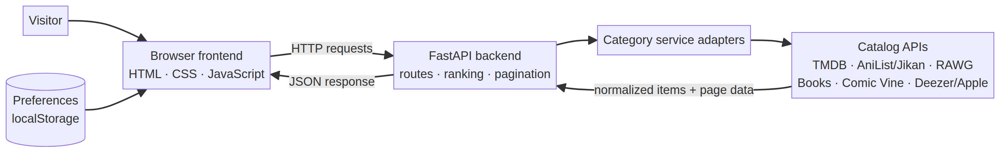

# AFTERGLOW
## Cross-Domain Entertainment Recommender
### Project Documentation & Class Presentation Guide

**Student:** ____________________
**Course / class:** ____________________
**Date:** ____________________
**Live demo:** [entertainment-recommender-frontend.vercel.app](https://entertainment-recommender-frontend.vercel.app/)
**API documentation:** [entertainment-recommender.onrender.com/docs](https://entertainment-recommender.onrender.com/docs)

---

## 1. Project overview

**Afterglow** is a web application that helps people discover entertainment across seven categories: **movies, series, anime, music, games, novels, and comics**. Instead of visiting a different catalog for each type of media, a user can browse them in one interface, tune the recommendations with their interests, filter the displayed items, and open a card for more information and useful links.

The application retrieves current catalog data from external services when needed. It does not maintain its own entertainment database. A small content-based scoring function adds a transparent “why this was suggested” explanation to personalized results.

### Problem statement

Entertainment catalogs are spread across many services, and a user may spend a long time searching before finding something appealing. Afterglow provides one place to explore different media types and narrows the choices using favorite genres or artists.

### Project objectives

- Combine discovery for seven entertainment categories in one responsive website.
- Let users save optional taste preferences and receive more relevant suggestions.
- Explain recommendations in understandable language.
- Make results interactive through clickable cards, details, ratings, links, and previews where available.
- Support searching, genre selection, minimum-rating filters, sorting, and progressive loading of more results.
- Keep provider failures from making a whole category unusable when a fallback source exists.

## 2. Main features

- **Onboarding:** Users can choose preferred genres by category; Music asks for favorite singers or artists. Setup can be skipped or revisited.
- **Two browsing modes:** **For me** uses saved preferences; **Explore all** shows popular, trending, or discovery results without requiring a profile.
- **Seven categories:** Movies, Series, Anime, Music, Games, Novels, and Comics.
- **Interactive result cards:** Cards open a details dialog with available artwork, synopsis, genres, rating, metadata, reason for the suggestion, and outbound links.
- **Filters and sorting:** Search loaded results, filter by genre and minimum rating, sort by recommendation order, rating, or title, and reset filters.
- **Progressive pagination:** “Load more” fetches the next provider page and appends unique items. The app does not attempt to download an entire external catalog at once.
- **Music support:** Deezer track results can include a short preview and listening link. When a preview is available, the details dialog provides a 30-second audio control. Music items also offer a **Search on Gaana** link; full playback opens on the linked provider.
- **Appearance and accessibility:** Dark/light themes, responsive layouts, subtle motion and gradient typography, keyboard-operable category tabs, and accessible labels.

## 3. Technology stack

| Layer | Technologies | Role |
|---|---|---|
| Frontend | HTML5, CSS3, vanilla JavaScript | Interface, preferences, filters, card rendering, pagination, and API requests |
| Backend | Python, FastAPI, Pydantic, HTTPX | API routes, request validation, provider calls, data normalization, and recommendation scoring |
| Catalog sources | Third-party APIs | Live entertainment metadata, images, ratings, links, and previews |
| Hosting | Vercel and Render | Static frontend and Python API hosting |
| Source control | Git and GitHub | Version history and deployment source |

No JavaScript package build is required for the frontend. The backend dependencies are listed in `backend/requirements.txt`.

## 4. System architecture



### Request flow

1. The browser loads the static frontend and reads any saved preferences from `localStorage`.
2. The user selects a mode, category, search, or filter. The frontend calls the matching FastAPI route.
3. The backend routes the request to a category-specific service adapter.
4. The adapter calls the relevant external catalog, normalizes provider-specific fields, and returns page information.
5. For **For me** requests, the recommender scores and explains each result. **Explore all** requests receive a simple trending/discovery explanation.
6. The frontend renders the results, filters them locally, and requests additional pages only when the user selects **Load more**.

The normal paginated response follows this general shape:

```json
{
  "items": [],
  "page": 1,
  "has_more": true,
  "total_results": 250,
  "source": "provider-name"
}
```

The exact `total_results` field may be absent or differ by provider. The `source` value helps keep later page requests on the same provider when a fallback was used for the first page.

### Project structure

```text
backend/
  main.py
  config.py
  models.py
  recommender.py
  services/
    tmdb.py
    anilist.py
    rawg.py
    books.py
    comicvine.py
    spotify.py

frontend/
  index.html
  app.js
  style.css
  config.js

render.yaml
DEPLOYMENT.md
docs/
  ANTICIPATED_QA.md
  PROJECT_DOCUMENTATION.md
  PROJECT_DOCUMENTATION.pdf
  assets/architecture.mmd
  assets/architecture.png
```

## 5. Recommendation logic

The recommender is a **transparent rule-based content scorer**, not a trained machine-learning model. It uses metadata already returned by the catalog services and does not need a training dataset.

For each item, the current score is:

```text
score = 3 × matching preferred genres
      + 4 (if at least two preferred genres match)
      + 1.5 × matching preference/favorite keywords in the description
      + 5 (if a favorite name appears in the title or credits)
```

The backend sorts personalized items by score and adds a reason such as **“Because you like [artist]”**, **“Matches your taste for [genre]”**, or **“Its description matches what you're into.”** A recommendation can receive a fallback explanation when provider metadata is missing. Explore mode is not scored against a user's tastes; it presents popular/trending results and labels them accordingly.

This approach is easy to explain and fast to run. Its trade-off is that recommendations depend on the quality and consistency of provider genres, descriptions, and credits.

## 6. External catalogs by category

| Category | Main provider(s) | How the app uses them |
|---|---|---|
| Movies and Series | TMDB | Search, trending/discovery, genre-based results, posters, ratings, synopsis, and title links. |
| Anime | AniList GraphQL; Jikan REST API as fallback | Popular, search, and genre-based anime results. The adapter retries AniList requests and can use Jikan when AniList is unavailable; successful anime results are briefly cached. |
| Games | RAWG | Search, popular/added ordering, genre filtering, ratings, artwork, platforms, stores, and game links. |
| Novels | Google Books, Project Gutenberg via Gutendex, and Open Library | Search and genre shelves use a provider fallback sequence. Explore starts with free/public-domain-oriented sources where possible. |
| Comics | Comic Vine | Comic volume search and detail links. The current Explore shelf starts from a catalog search seed. |
| Music | Deezer, with Apple/iTunes fallback; optional Spotify helper support | Deezer is the primary paginated track search and supplies preview/listen links when available. Apple/iTunes is a first-page fallback; Spotify compatibility functions remain in the backend. |

Some provider APIs require credentials. The application keeps these credentials in backend environment variables rather than sending them to the browser. AniList, Jikan, Deezer, and Apple/iTunes searches used here do not require a user login. Availability, ratings, previews, and genre metadata vary by provider and region.

### Pagination and output limits

“Load more” removes the old **single-page display ceiling** from the user experience: it requests another page while the upstream provider reports more results. It does not make the catalogs infinite. Providers have different page sizes, quotas, and maximum searchable ranges. Current implementations include 40-item pages for RAWG and book services, 10-item pages for Comic Vine, 50-item Deezer pages, and provider-defined paging for TMDB and anime. Apple/iTunes is a fallback for the first page and does not provide the same continuation behavior in this implementation.

## 7. API reference

The FastAPI application exposes these route patterns:

| Method | Route | Purpose |
|---|---|---|
| `GET` | `/` | Health response and supported category names |
| `GET` | `/explore/{domain}?page=1` | Popular, trending, or discovery results |
| `POST` | `/for-me/{domain}?page=1` | Personalized results using a preference object |
| `GET` | `/search/{domain}?q=...&page=1` | Search within a category |

Supported domain slugs: `movies`, `series`, `anime`, `music`, `games`, `novels`, and `comics`. Routes also accept a `source` parameter where needed to continue on the provider selected for a previous page.

Example requests:

```http
GET /explore/movies?page=1
GET /search/music?q=Hindi%20Bollywood%20songs&page=1
POST /for-me/movies?page=1
Content-Type: application/json

{"genres": ["Action", "Science Fiction"], "favorites": []}
```

The `Preferences` model accepts optional `genres` and `favorites` arrays. The route validates page numbers and returns a not-found response for unsupported domains. Provider errors are surfaced as clear error responses rather than silently showing an unrelated category.

## 8. Data, privacy, and security

- There is **no user account system and no project database**. The user's preferences, onboarding state, and theme are saved in that browser's `localStorage`.
- Preferences are sent to the backend with a recommendation request and used to rank that response; the application does not store a server-side user history.
- Provider API keys belong in backend environment variables or a local `.env` file. The `.env` file is ignored by Git. Never put a key in frontend JavaScript or commit a real key.
- The current `backend/.env.example` uses blank placeholders. If any real credentials were committed earlier, they should be revoked or rotated because deleting them from the latest file does not erase Git history.
- The current FastAPI CORS configuration allows all origins. For a production system with known frontend domains, restricting allowed origins is a sensible hardening step.
- Availability hints such as Tubi or Pluto TV are suggestions, not a guaranteed real-time, title-by-title streaming-rights check. Users should verify their region and provider.

## 9. Local setup

### Requirements

- Python 3.10 or newer
- `pip`
- A browser
- API credentials for providers that require them

### Start the backend

```bash
cd backend
python -m venv .venv
# macOS/Linux:
source .venv/bin/activate
# Windows PowerShell:
# .venv\Scripts\Activate.ps1
pip install -r requirements.txt
cp .env.example .env
```

Edit `backend/.env` and add the credentials for TMDB, RAWG, and Comic Vine. A Google Books key is optional. Spotify credentials are optional for the compatibility helper; the current Deezer and Apple/iTunes search paths do not require them.

Run the API from the `backend` directory:

```bash
uvicorn main:app --reload --port 8000
```

The interactive API page should then be available at `http://127.0.0.1:8000/docs`.

### Start the frontend

In a second terminal:

```bash
cd frontend
python -m http.server 5500
```

Open `http://127.0.0.1:5500`. The checked-in `frontend/config.js` currently points at the deployed Render API. To test against the local backend, change `API_BASE` there to `http://127.0.0.1:8000`.

## 10. Deployment

The project is deployed as two services:

- **Frontend:** Vercel static site — [live website](https://entertainment-recommender-frontend.vercel.app/)
- **Backend:** Render FastAPI service — [API root](https://entertainment-recommender.onrender.com/) and [interactive API docs](https://entertainment-recommender.onrender.com/docs)

The backend is configured in `render.yaml`; it installs `backend/requirements.txt` and starts Uvicorn on the port supplied by the host. The frontend is plain static HTML, CSS, and JavaScript with no build step. `frontend/config.js` determines which backend URL the page calls.

## 11. Testing and known limitations

### Manual test checklist

1. Open the site and complete onboarding, then edit the preferences.
2. Switch between **For me** and **Explore all** and visit each category.
3. Use search, genre, minimum-rating, and sort controls; reset them.
4. Open a result card and inspect its details and outbound links.
5. In Music, select a genre, open a track, and check for an available preview and Gaana search link.
6. Select **Load more** and confirm additional unique results appear when the provider reports another page.
7. Test both dark and light themes and reload to confirm saved browser settings remain.

The repository does not currently include a dedicated automated test suite, so these checks should be supplemented with automated route and provider-mock tests in future work.

### Known limitations

- Results and continuation depend on external API availability, account quotas, rate limits, and catalog coverage.
- Providers do not share one standard rating scale or complete metadata; some items have no rating, description, or genre tags.
- Music genre search is constrained by catalog search behavior and available metadata; a text search is not always equivalent to a formal genre classification.
- Pagination is progressive and provider-bounded—not an unlimited, fully exhaustive download.
- The recommendation algorithm is rule-based and does not learn from clicks, ratings, or watch/listening history.
- Preferences are browser-specific. Clearing local storage or switching devices removes access to those local preferences.
- The static free-streaming suggestions do not verify a specific title's current availability.

## 12. Future improvements

- Add automated tests for API routes, pagination, provider fallbacks, filters, and scoring.
- Restrict production CORS to the deployed frontend and add monitoring for provider failures and quotas.
- Add optional accounts or encrypted cloud-synced profiles only if cross-device personalization is needed.
- Improve music genre classification by combining provider tags with curated mappings and relevance checks.
- Replace static availability hints with a reliable licensed provider-availability source.
- Add optional thumbs-up/down feedback and use it to tune the transparent content-based ranking.
- Add caching for more high-volume catalog requests while respecting provider terms and freshness.

## 13. Suggested class presentation

### Short speaking script (about 90 seconds)

> Good morning. My project is Afterglow, a cross-domain entertainment recommender. It brings movies, series, anime, music, games, novels, and comics into one website. The problem it addresses is that entertainment discovery is spread across many different catalogs, which makes it hard to find something that matches a person's interests.
>
> The frontend is built with HTML, CSS, and JavaScript. A FastAPI backend receives requests and connects to catalog services such as TMDB, AniList, RAWG, Google Books, Comic Vine, and Deezer. The backend normalizes those different responses so the interface can display them consistently.
>
> Users can choose genres or favorite artists. For personalized recommendations, a simple content-based scoring algorithm rewards matching genres, relevant description keywords, and favorite names. Each result includes a reason, so users can understand why it appeared. Users can also search, filter, sort, open details, and load more provider pages.
>
> The project does not use a user database or train a machine-learning model; preferences stay in the browser. A future version could add automated tests, better music genre classification, and stronger feedback-based personalization.

### Live demo sequence

1. Open the live website and explain the seven categories.
2. Select **Explore all** and open a category tab.
3. Demonstrate search, genre, rating, and sort controls.
4. Open a card and point out its reason, metadata, and external link.
5. Switch to Music and show a track preview if one is available, plus the Gaana link.
6. Open **Edit your taste**, select a genre or artist, save, then show **For me**.
7. Select **Load more** to demonstrate progressive provider pagination.

### Likely questions and answers

**Q: Is this machine learning?**
A: Not currently. It is a content-based recommendation system with explicit rules and a score that can be inspected and explained. There is no model training or user behavior history.

**Q: How does personalization work?**
A: The browser saves selected genres and favorite artists. It sends them with a request, and the backend scores items using genre overlap, description keywords, and favorite-name matches.

**Q: Why use multiple APIs?**
A: Different providers specialize in different media. Using each category's catalog avoids building and maintaining a large manual dataset, while provider adapters translate their results into a common format.

**Q: What happens if one provider fails?**
A: Some categories have alternatives—for example, AniList can fall back to Jikan, novels can use multiple book sources, and Music can use Apple/iTunes when the primary paginated search is unavailable on the first page. Other provider failures are reported as an error.

**Q: Does “Load more” mean unlimited results?**
A: No. It removes the fixed one-page view and continues while the upstream service has more results. Every provider still has its own catalog, quota, and paging limits.

**Q: Where are user preferences stored?**
A: In the browser's local storage. There is no login or central user database, so preferences do not automatically follow a user to another device.

## 14. Glossary

- **API:** A defined way for one software system to request data or actions from another.
- **Adapter:** Code that converts a provider's data into the application's common item format.
- **Content-based recommendation:** Ranking items by features such as genres, descriptions, or favorite names rather than by similar users.
- **Pagination:** Fetching results a page at a time instead of requesting the full catalog in one response.
- **CORS:** A browser security mechanism that controls which websites may call a backend from another origin.
- **`localStorage`:** Browser storage that persists small values, such as preferences, on the user's device.

## 15. Reference links

- [TMDB Developer Documentation](https://developer.themoviedb.org/docs)
- [AniList API Documentation](https://docs.anilist.co/)
- [Jikan API Documentation](https://docs.api.jikan.moe/)
- [RAWG API](https://rawg.io/apidocs)
- [Google Books API](https://developers.google.com/books/docs/v1/using)
- [Gutendex](https://gutendex.com/)
- [Open Library APIs](https://openlibrary.org/developers/api)
- [Comic Vine API](https://comicvine.gamespot.com/api/)
- [Deezer API](https://developers.deezer.com/api)
- [Apple iTunes Search API](https://developer.apple.com/library/archive/documentation/AudioVideo/Conceptual/iTuneSearchAPI/Searching.html)
- [GitHub project repository](https://github.com/hh9466528027-rgb/entertainment-recommender)
